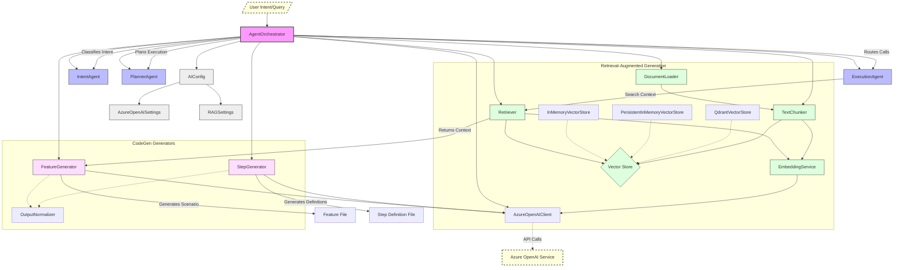
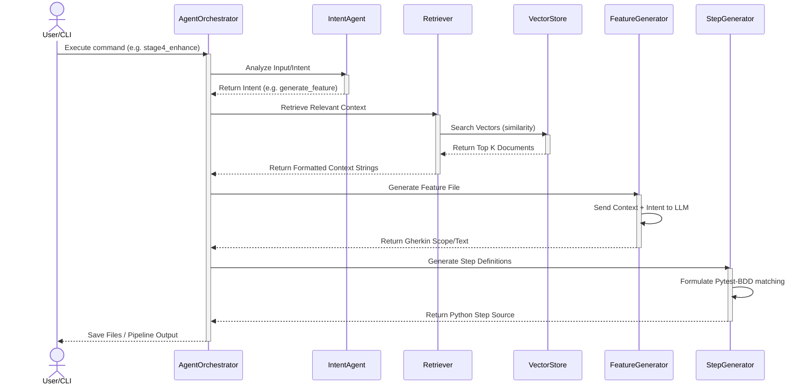

# Agentic AI Framework Diagrams

## Architecture Diagram
This diagram shows the main components, classes, and their relationships within the AI subsystem.

## System Flow Diagram
This sequence diagram outlines the pipeline workflow from an external UI recording or user input, down through RAG and code generation.

